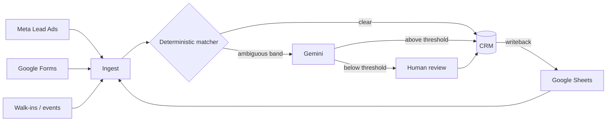
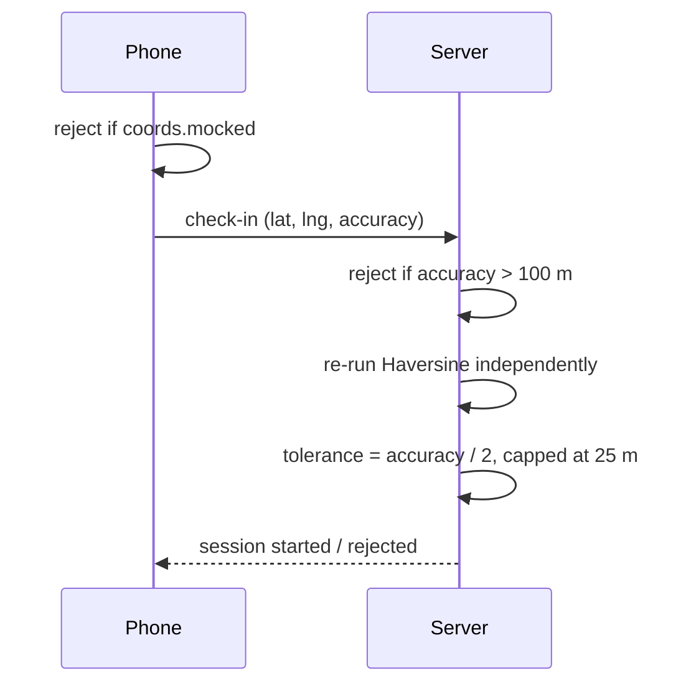

# M. Zorigt

**I design, build, deploy and operate production systems — end to end, solo.**

Ulaanbaatar, Mongolia · UTC+8

 

&nbsp;&nbsp;&nbsp;

Two systems below are in production today: a CRM running the full enrollment pipeline of
an eight-branch education group, and a geofence-verified membership platform for a 24/7
gym. Both built alone, end to end — schema, API, background jobs, frontend, deploy
pipeline. Currently operating and extending both; open to full-stack roles and contract
work.

---

## TEMS — enrollment CRM for TEE, an eight-branch education group

  

One system running the pipeline from ad click to signed contract — in daily use by
sales, HR, finance and branch teams.

Leads used to arrive through five unconnected channels: Meta Lead Ads, Google Forms,
walk-ins, events, and the Google Sheets the sales team already lived in. Nobody could
answer *"how many of last month's ad leads actually enrolled, and at which branch?"* —
duplicate parents were counted twice, and contracts and payments were tracked by hand.

**An LLM only where it earns its cost.** Mongolian names arrive in both Cyrillic and
Latin transliteration. A deterministic matcher — reduced transliteration + token sort +
trigram similarity — resolves the clear cases for free; only the ambiguous middle band
goes to Gemini, and its verdict is accepted only above a confidence threshold.
Otherwise a human decides. Siblings are structurally prevented from ever being merged.

**A merge engine that fails closed.** It refuses to run if a new table references leads
without being registered in its known-FK set — so a future migration cannot silently
orphan data. A loud failure beats silent data loss.

**Meet users where they already are.** Instead of forcing the sales team off
spreadsheets, a BullMQ worker makes the sheet a first-class synced surface: idempotent
import (content-hashed keys, so re-runs are no-ops) plus writeback of CRM state into
the sheet. The adoption problem was solved by architecture.

          

71 versioned SQL migrations, applied automatically on every deploy · 8 background
workers · 28 backend services · 67 test files · 44 operational scripts, all
preview-by-default — nothing writes to production without an explicit `--apply` flag

> [!NOTE]
> The repository is private — it holds a client's production data model. I'm happy to
> walk through the architecture and code live.

More decisions, and how a lead becomes exactly one clean record

- **8-state lead lifecycle** enforced by a server-side transition state machine —
  `ENROLLED` is reachable *only* through verified contract ingestion; a status can't be
  faked from the UI.
- **RBAC across 8 roles** on a page × action matrix. Branch-scoped roles are
  hard-filtered at the SQL layer on every read and ownership-checked on every write —
  not merely hidden in the UI.
- **Finance:** grade-derived tuition, discount snapshots, installment schedules, and an
  audit ledger.
- Also in the stack: Neon Postgres · Vite · React Router 7 · Recharts · PM2 · nginx ·
  Meta Lead Ads webhooks · Google Sheets/Forms API · Moodle.

---

## ANYTIME — geofenced membership for a 24/7 gym

  

Mobile app, REST API and manager dashboard for ANYTIME 24/7 fitness in Ulaanbaatar —
deployed and running on ~$5/month of infrastructure.

A 24/7 gym has no staff at the door for most of the day. Membership check-in has to be
self-service, trustworthy, and impossible to fake from a couch across town.

**Anti-spoofing as layered defence, not a checkbox.** The client checks `coords.mocked`
to catch mock-location apps; the server independently re-runs the Haversine distance
calculation rather than trusting a client-reported "I'm inside". Readings with accuracy
worse than 100 m are rejected outright, and the geofence tolerance scales with reported
accuracy (accuracy / 2, capped at 25 m) instead of one fixed radius.

**Sessions that survive the phone being pocketed.** Background tracking via
`expo-task-manager` with an Android foreground-service notification keeps a workout
session accruing while the app is off-screen. GPS acquisition is wrapped in a 10-second
`Promise.race`, so the UI degrades to an explicit timeout state instead of hanging.

**One backend, three very different clients.** A NestJS + Prisma API serves a React
Native app, a Vite/React manager dashboard, and CI — JWT auth (bcrypt cost 12,
rate-limited to 5 requests/min on auth routes), with the Prisma schema as the single
source of truth across all three.

       

15 Prisma models · 17 migrations · 13 backend modules · 17 backend test suites ·
CI on backend and mobile · Android APK via EAS Build · total infrastructure ≈ $5/month

Feature surface, and what a check-in actually verifies

Email-verified JWT auth · geofenced check-in in under 2 seconds · session and streak
points · workout plans · exercise and equipment library · trainer↔member messaging ·
leaderboard · push notifications · manager dashboard.

Built as a B.Sc. thesis project (MUST, 2026) — but deployed against a real gym, not a
demo.

---

## Stack

| | |
|---|---|
| **Backend** |         |
| **Web & mobile** |         |
| **Data** |    |
| **Ops & delivery** |         |

---

🇲🇳 Монголоор

### TEMS

Найман салбартай хувийн сургалтын байгууллагын элсэлтийн бүх урсгалыг — зарын
даралтаас гэрээ байгуулах хүртэл — хөтөлдөг CRM. Борлуулалт, хүний нөөц, санхүү,
салбарын багууд өдөр бүр ашигладаг.

**Асуудал.** Хүсэлтүүд Meta Lead Ads, Google Forms, биечлэн ирсэн, арга хэмжээ, Google
Sheets гэсэн хоорондоо холбоогүй таван сувгаар ирдэг байв. «Өнгөрсөн сарын зарын
хүсэлтүүдээс хэд нь үнэхээр элссэн бэ, аль салбарт?» гэдэгт хэн ч хариулж чадахгүй,
давхардсан эцэг эх хоёр удаа тоологдож, гэрээ болон төлбөрийг гараар хөтөлж байлаа.

1. **LLM-ийг зөвхөн үнэ цэнээ өгөх газарт нь.** Монгол нэрс кирилл, латин галигаар
   холилдон ирдэг. Тодорхой тохиолдлыг детерминист тааруулагч (галиг хялбарчлал +
   токен эрэмбэ + триграм ижилслэл) үнэгүй шийдэж, зөвхөн эргэлзээтэй дунд хэсгийг
   Gemini-д илгээдэг; итгэлцлийн босго давсан үед л хариуг хүлээн авч, бусад үед хүн
   шийддэг. Ах дүүс хоорондоо нэгтгэгдэхээс бүтцийн түвшинд хамгаалагдсан.
2. **Алдаа гарвал зогсдог нэгтгэлийн хөдөлгүүр.** Шинэ хүснэгт lead-рүү холбогдсон
   мөртлөө бүртгэлтэй FK багцад нь ороогүй бол ажиллахаас татгалздаг — ирээдүйн
   миграци өгөгдлийг чимээгүй орхигдуулж чадахгүй.
3. **Хэрэглэгчдийг байгаа газарт нь угтах.** Борлуулалтын багийг хүснэгтээс нь
   салгахын оронд BullMQ worker Google Sheets-ийг бүрэн синктэй гадаргуу болгосон:
   idempotent импорт (контент-хэшлэсэн түлхүүр — давтан ажиллуулахад өөрчлөлт гарахгүй)
   ба CRM төлөвийг хүснэгт рүү буцааж бичдэг.

### ANYTIME

Улаанбаатар дахь ANYTIME 24/7 фитнесийн гишүүнчлэлийн платформ: мобайл апп, REST API,
менежерийн самбар. Сарын ~5 ам.долларын дэд бүтэц дээр ажиллаж байна.

**Асуудал.** 24/7 фитнес өдрийн ихэнх цагт үүдэндээ ажилтангүй. Гишүүнчлэлийн бүртгэл
өөрөө үйлчилгээтэй, найдвартай, гэрээсээ хуурамчаар хийх боломжгүй байх ёстой.

1. **Хуурамч байршлын эсрэг давхарласан хамгаалалт.** Клиент `coords.mocked`-г шалгаж
   mock-location аппыг барьдаг; сервер клиентэд итгэхийн оронд Haversine зайг өөрөө
   дахин тооцдог. 100 м-ээс муу нарийвчлалтай хэмжилтийг шууд хааж, geofence-ийн
   зөвшөөрөл нарийвчлалтай уялдан (нарийвчлал / 2, дээд тал нь 25 м) өөрчлөгддөг.
2. **Утас халаасанд байхад ч тасрахгүй сесс.** `expo-task-manager` + Android
   foreground-service мэдэгдлээр дасгалын сесс арын горимд үргэлжилдэг. GPS авалт
   10 секундын `Promise.race`-д ороосон тул UI гацахын оронд "timeout" төлөвт ил
   шилждэг.
3. **Нэг backend, гурван өөр клиент.** NestJS + Prisma API нь React Native апп,
   Vite/React самбар, CI гурвыг зэрэг үйлчилдэг; JWT auth (bcrypt cost 12, auth зам
   дээр минутад 5 хүсэлт), Prisma схем нь гурвуулангийн цорын ганц үнэний эх сурвалж.

---

Open to full-stack roles and contract work · <a href="https://www.linkedin.com/in/YOUR-HANDLE">LinkedIn</a> · <a href="mailto:YOU@EXAMPLE.COM">email</a> · Ulaanbaatar, UTC+8

